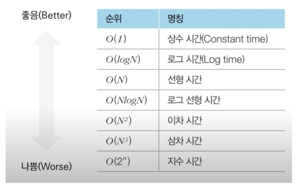

# 알고리즘
**시간 복잡도**: 특정한 크기의 입력에 대하여 알고리즘의 수행 시간 분석
**공간 복잡도**: 특정한 크기의 입력에 대하여 알고리즘의 메모리 사용량 분석  
빅오 표기법(Big-O Notation): 복잡도를 나타내기 위한 표기 방법

- `가장 빠르게 증가하는 항` 만 고려한다.
- ex. 3N^3 + 5N^2 + 1,000,000 일 때, 빅오 표기법에서는 차수가 가장 큰 O(N^3)으로 표현

# Dynamic Programming
## 메모이제이션 (Memoization)
메모이제이션은 탑다운 방식에서 사용됩니다. 한 번 계산된 결과를 메모리 공간에 저장하는 기법입니다.
- 같은 문제를 다시 호출하면 메모했던 결과를 그대로 가져옵니다.
- 값을 기록해 놓는다는 점에서 **캐싱(Caching)** 이라고도 합니다.

## 탑다운 VS 보텀업
- 탑다운(메모이제이션) 방식은 **하향식**이라고도 하며 보톰업 방식은 **상향식**이라고도 합니다.
- 다이나믹 프로그래밍의 전형적인 형태는 보텀업 방식입니다.
    - 결과 저장용 리스트는 DP 테이블이라고 부릅니다.
- 엄밀히 말하면 메모이제이션은 **이전에 계산된 결과를 일시적으로 기록해 놓는 넓은 개념을 의미**합니다.
    - 따라서 메모이제이션은 다이나믹 프로그래밍에 국한된 개념은 아닙니다.
    - 한 번 계산된 결과를 담아 놓기만 하고 다이나믹 프로그래밍을 위해 활용하지 않을 수도 있습니다.

## 다이나믹 프로그래밍 VS 분할 정복
- 다이나믹 프로그래밍과 분할 정복은 모두 **최적 부분 구조**를 가질 때 사용할 수 있습니다.
    - 큰 문제를 작은 문제로 나눌 수 있으며 작은 문제의 답을 모아서 큰 문제를 해결할 수 있는 상황
- 다이나믹 프로그래밍과 분할 정복의 차이점은 **부분 문제의 중복**입니다.
    - 다이나믹 프로그래밍 문제에서는 각 부분 문제들이 서로 영향을 미치며 부분 문제가 중복됩니다.
    - 분할 정복 문제에서는 동일한 부분 문제가 반복적으로 계산되지 않습니다.
        - **분할 정복**의 대표적인 예시인 퀵 정렬을 살펴봅시다.
            - 한번 기준 원소(Pivot)가 자리를 변경해서 자리를 잡으면 그 기준 원소의 위치는 바뀌지 않습니다.
            - 분할 이후에 해당 피벗을 다시 처리하는 부분 문제는 호출하지 않습니다.

## 다이나믹 프로그래밍 문제에 접근하는 방법
- 주어진 문제가 **다이나믹 프로그래밍 유형임을 파악**하는 것이 중요합니다.
- 가장 먼저 그리디, 구현, 완전 탐색 등의 아이디어로 문제를 해결할 수 있는지 검토할 수 있습니다.
    - 다른 알고리즘으로 풀이 방법이 떠오르지 않다면 다이나믹 프로그래밍을 고려해 봅시다.
- 일단 재귀 함수로 비효율적인 완전 탐색 프로그램을 작성한 뒤에 (탑다운) 작은 문제에서 구한 답이 큰 문제에서 그대로 사용될 수 있으면, 코드를 개선하는 방법을 사용할 수 있습니다.
- 일반적인 코딩 테스트 수준에서는 기본 유형의 다이나믹 프로그래밍 문제가 출제되는 경우가 많습니다.
# 완전탐색 (Exhaustive Search)
- 모든 경우의 수를 시도해보는 방법
- 상대적으로 구현이 간단하 해가 존재한다면 항상 찾게 됨
- 경우의 수에 따라 실행 시간이 비례하기 때문에 입력 값의 범위가 작은 경우에 유용

## 순차탐색 (Sequential Search)
순차탐색은 어떠한 값을 찾고자 할 때 하나씩 비교해보는 방법을 말합니다.

## 이진탐색
이진탐색은 범위의 중간 값을 찾아 찾으려는 값과 비교하여 범위를 좁혀나가는 방법을 말합니다.
> 이진탐색의 경우 정렬이 잘 되어있는 경우 사용할 수 있습니다.

# 탐욕법
그리디 알고리즘이란 현재 상황에서 가장 좋은 최선의 선택을 고르는 알고리즘을 말합니다. 그리디 알고리즘은 간단한 문제 해결에 다이나믹 프로그래밍을 사용하면 지나치게 많은 일을 한다는 것에서 고안된 알고리즘입니다. 따라서 그리디 알고리즘은 최적해를 보장하지는 않습니다.

# 해시 (Hash)
- 임의의 크기를 가진 데이터(Key)를 고정된 크기의 데이터(Value)로 변화시켜 저장하는 것
- 키에 대한 해시 값을 사용하여 값을 저장하고 키-값 쌍의 갯수에 따라 동적으로 크기가 증가하는 연관 배열
- 키에 대한 해시 값을 구하는 과정을 해싱(Hashing)이라고 하며 이때 사용하는 함수(알고리즘) 해시 함수(Hash Function)이라고 한다.
- 해시 값 자체를 index로 사용하기 때문에 평균 시간 복잡도가 O(1)로 매우 빠름

> **연관 배열?**  
> **연관 배열**(associative array)은 자료구조의 하나로, 키 하나와 값 하나가 연관되어 있으며 키를 통해 연관되는 값을 얻을 수 있다.

## 해시 함수 (Hash Function)
- 임의의 길이의 데이터를 입력받아 일정한 길이의 비트열로 반환시켜주는 함수
- 원래의 값이나 키를 색인하는데 사용되며, 그 값이 관련된 데이터가 검색될 때마다 다시 사용된다.
- 데이터의 효율적 관리를 목적으로 임의의 길이의 데이터를 고정된 길이의 데이터로 매핑하는 함수
- 계산이 복잡하지 않고 중복 키 값 없이 해시값을 고르게 만드는 함수가 좋다. (충돌이 일어나지 않을수록)
- 문자열(string)을 받아서 숫자를 반환하는 함수 (함수는 문자열에 대해 숫자를 매핑)

## 해싱 (Hashing)
- 키 값에 산술 연산을 적용하여 저장되어 있는 테이블의 주소를 계산하여 항목에 접근
- 매핑하는 과정을 말한다.
- 키(key): 매핑 전 원래 데이터 값
- 해시값: 매핑 후 데이터

## 장점
- 해시 충돌이 발생할 가능성이 있지만, 적은 리소스로 많은 데이터를 효율적으로 관리할 수 있음
- index에 해시 값을 사용하므로 모든 데이터를 살피지 않아도 검색과 삽입/삭제를 빠르게 수행
- 해시 함수는 언제나 동일한 해시 값을 리턴하고 index만 알면 해시 테이블의 크기와 상관없이 데이터에 빠르게 접근 가능
- 데이터 엑세스(삽입, 삭제, 탐색)시 시간 복잡도 O(1)을 지향한다.

## Refer
https://coding-sojin2.tistory.com/entry/%ED%95%B4%EC%8B%9C-%EC%95%8C%EA%B3%A0%EB%A6%AC%EC%A6%98-hash-algorithm
