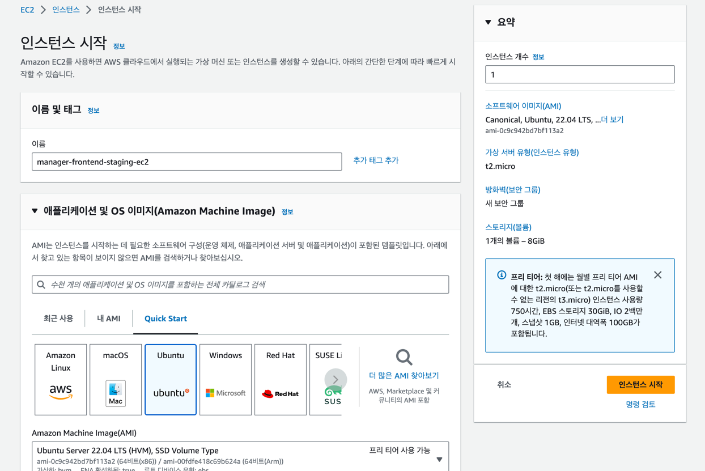
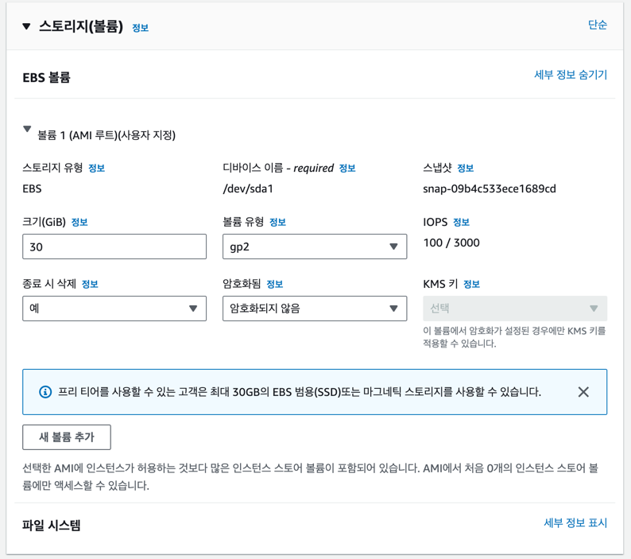
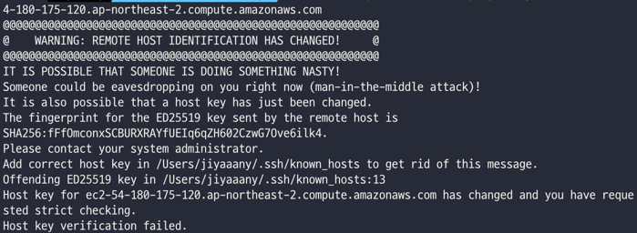
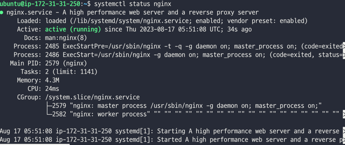

# EC2 설정하기

서비스에 맞는 컨테이너 이름을 설정해주고, AMI는 **ubuntu**를 사용한다. 작성 시점(23.08.17) 기준 22.0.4 버전이
LTS였기에 해당 버전을 사용하였으며, LTS 버전을 사용하는 것을 권장한다.

인스턴스 유형은 컨테이너 생성 후 변경이 가능하니 프리티어로 사용할 수 있는 t2.micro로 설정해주고 필요하다면 나중에 바꾸도록 한다.
여러 번 ec2 재생성을 하고 있는 중이라 키 페어나 보안 그룹은 기존에 있는 것을 사용하였다. (생성하는 방법은 추후 추가 예정)

스토리지 역시 프리티어로 사용 가능한 30GB로 설정해주었다.

스토리지 설정까지 마쳤다면 `인스턴스 시작`!

# 탄력적 IP
ec2는 재부팅 시 IP가 재할당되어 매번 바뀌게 된다. 고정된 IP를 설정하기 위해 탄력적 IP 설정을 해주어야 한다.

좌측 메뉴에 `탄력적 IP` 메뉴로 들어가준다.


생성된 탄력적 IP를 선택하고 `작업 > 탄력적 IP 주소 연결` 을 선택해준다.

리소스 유형은 '인스턴스'를 선택해주고, 아래 인스턴스 검색란에서 전에 만든 ec2 이름을 검색하여 선택해준다. 필자의 경우, 기존에 생성했던 인스턴스와 탄력적 IP가
연결되어 있어, 아래 재연결에 체크해주었지만 처음 연결하는 경우 체크하지 않고 `연결`을 눌러주면 된다.

# EC2 연결 및 내부 설정

탄력적 IP 세팅까지 됐다면 직접 ec2에 연결하여 내부에서 nginx, codedeploy, docker 설정을 해주어야 한다. 다시 ec2 메뉴로 돌아와 생성했던
컨테이너를 선택해주고, 우측 위 `연결`을 눌러준다.

ssh로 연결하는 방법은 위 단계를 그대로 따라해주면 된다. 인스턴스 생성할 때 만들거나 연결했던 키 페어의 위치로 가서 명령어를 차례대로 실행해주면 된다. 

## ssh 연결 안되는 문제

하나의 탄력적 IP에 계속해서 다른 인스턴스를 할당해서인지 ssh 연결이 실패하는 오류를 마주했다. 오류 내용은 대충 아래와 같았고, 해결 방법은 금방 찾아낼 수 있었다.
```
REMOTE HOST IDENTIFICATION HAS CHANGED!
```

[해결 방법]
```
ssh-keygen -R [ IP or DomainName]
```
위 명령어를 통해 초기화해주고 나서 다시 ssh 연결 명령어를 실행하면 잘 접속되는 것을 볼 수 있다.

# nginx 설정
```
sudo apt update
sudo apt install nginx
```

설치되고 나서 아래 명령어를 실행했을 때 `running`이라고 뜨면 nginx가 잘 실행되고 있는 것이다.
```
systemctl status nginx
```


또는 탄력적 IP 주소로 접속하여 `Welcome to nginx!` 문구를 보았다면 nginx 설치에 성공한 것이다.


nginx 설정 파일을 변경하기 위해 아래 명령어를 입력한다.
```
vi /etc/nginx/site-available/default
```

```
server {

    listen 80;
    listen [::]:80;
	
    server_name _;
	
    location / {
    	proxy_pass http://127.0.0.1:3000;
    }

}
```

설정 파일 변경 후 nginx 재부팅
```
sudo systemctl restart nginx
```

# code deploy 설정

Code deploy 서비스로 들어가서 `애플리케이션` 메뉴를 선택해준다.


배포 그룹을 선택해준 후 우측 `편집` 메뉴를 눌러준다.


편집 화면 들어가면 아래 쪽에 `환경 구성`으로 내려가 EC2 인스턴스와 연결해준다. 연결은 생성할 때 설정했던 Name으로 할 수 있다. 

이제 다시 EC2로 돌아와 컨테이너 내부에 codedeploy-agent를 설치해준다.

## 1. apt 저장소 업데이트
```
sudo apt-get update
```

## 2. ruby 설치
```
sudo apt-get install ruby
```

## 3. wget 설치
```
sudo apt-get install wget
```

## 4. agent 설치
```
wget https://aws-codedeploy-ap-northeast-2.s3.ap-northeast-2.amazonaws.com/latest/install

chmod +x ./install
sudo ./install auto
```

## 5. 서비스 확인
```
sudo service codedeploy-agent status
```

nginx와 마찬가지로 `running` 키워드가 보인다면 잘 설치된 것이다.

# Docker 설치
EC2 내부 Docker 설치 방법은 [해당 아티클](https://velog.io/@osk3856/Docker-Ubuntu-22.04-Docker-Installation)을 그대로 따라했다.

# at 설치
```
sudo apt install at
```

이렇게까지 세팅을 마친 후, Code deploy 서비스에서 실패했던 배포를 재시도 했다.


