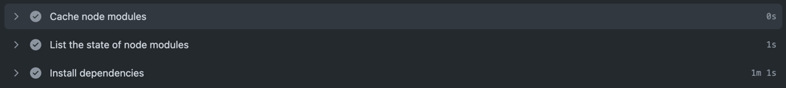
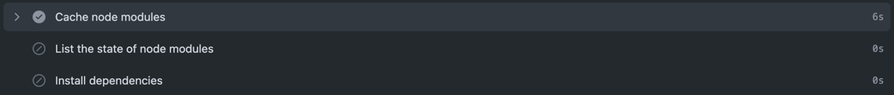

# 시작하며
CI구성을 어떤 식으로 하고 계신가요? CI란 개발자를 위한 자동화 프로세스인 **지속적인 통합**(Continuous Intergration)을
의미합니다. 지속적 통합이 잘 구현되어 있는 경우 코드 변경 사항이 생겼을 때 정기적으로 빌드 또는 테스트를 거쳐 리포지토리에 병합됩니다.  
이 외에도 CI는 코드 포맷팅이나 Storybook을 배포하는 용도로 쓰일 수 있을 것 같습니다.
# 문제는 무엇인가

디자인시스템을 구축하며 Storybook과 함께 [Chromatic](https://www.chromatic.com/)이라는 툴을 채택해 사용하고 있습니다.
Chromatic은 UI 컴포넌트 개발 과정에서 피드백과 의견 수집을 돕는 툴로 Storybook과 함께 사용할 경우 큰 시너지 효과를 낼 수 있습니다.  
Chromatic은 매 작업물마다 고유의 링크를 생성하여 디자이너와의 피드백이 가능한 툴입니다. 디자인 리뷰계의 Pull Reqeust라고 생각하면 이해가 쉽습니다. 
문제는 작업물을 Chromatic 배포하는데까지 약 3분이 넘는 시간이 소요된다는 것입니다. 작업물 하나에 3분이라면 기다릴 수 있는 시간으로 생각될 수 있지만 컴포넌트 단위로
새로운 작업물이 발생하는 디자인 시스템의 경우 배포로 인해 발생되는 지연 시간이 길어질 수 있습니다.

# 해결 과정
## 의존성 캐싱

먼저 첫번째로 시도한 방법은 사용하는 의존성을 캐싱해두는 것입니다. Github Actions에는 캐싱을 할 수 있는 공간이 존재하기 때문에
지정한 단위별로 캐싱할 수 있습니다. 저의 경우 브랜치 단위로 의존성을 캐싱했어요.

캐싱 하지 않았을 때 `yarn install` 명령어가 실행되는 Install dependencies 단계의 소요 시간은 약 1분 가량이었습니다. 설치됐던 의존성을 캐싱해두었다가
또 다시 CI가 발생되면 그 결과는 아래와 같습니다.

캐싱된 node_modules를 가져오게 되고 Install dependencies 단계가 생략됩니다. 따라서 Cache를 확인하고 설치까지의 소요시간이 단 6초로 단축됩니다. 
작업물을 처음 푸시할 경우에는 캐싱되어 있는 의존성이 없기 때문에
첫 수행때는 무조건적으로 의존성 설치 시간이 소요된다는 점이 있지만, 지속적으로 발생하는 CI 시간을 줄일 수 있다는
점에서 의존성 캐싱은 필요하다고 생각했습니다.
# 그래서 결과는

수치로 보자면 약 2분 가량 줄었지만 아직도 Chromtaic 배포에 소요되는 시간이 약 1분 가량 걸립니다. 단축된 2분은 의존성 설치 과정에 소요되는 시간으로
생각하시면 될 것 같습니다. Chromatic은 작업물의 변경점을 확인시켜주는 도구이기 때문에 캐싱으로 해결할 수 없습니다. 의존성 캐싱 외에 CI 시간을 단축할 수 있는 방법을
조금 더 생각해볼 필요가 있습니다.

# 마치며
