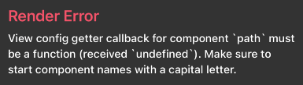

#시작하며
#리뉴얼 과정
## 스택
현재 어플리케이션 스택은 웹 앱으로 되어있어 웹 코드에 앱 껍데기를 씌운 형태이다. 사이드로 진행하는 프로젝트이기 때문에 네이티브 개발을 하는데에 한계가 있어 [React Native](https://reactnative.dev/) 를 선택했다.
## 주요 과정
###1. [React Navigation](https://reactnavigation.org/)
#### Install
expo 프로젝트의 경우 설치 방법이 다를 수 있으니 공식 문서를 참고하는 것이 좋다.
```
npm install @react-navigation/native
npm install react-native-screens react-native-safe-area-context

or

yarn add @react-navigation/native
yarn add react-native-screens react-native-safe-area-context
```

```
npx pod-install ios
```
#### `MainActivity.java`
```
import android.os.Bundle;

@Override
    protected void onCreate(Bundle savedInstanceState) {
    super.onCreate(null);
}
```

#### Tab navigation
```
yarn add @react-navigation/bottom-tabs
```

###2. React Native Elements
#### Install
```
npm install react-native-elements

# or with yarn
yarn add react-native-elements
```

#### Install react-native-vector-icons
```
npm install react-native-vector-icons

# or with yarn
yarn add react-native-vector-icons
```

### Install react-native-safe-area-context
```
npm install react-native-safe-area-context
# or with yarn
yarn add react-native-safe-area-context
```

## 트러블 슈팅
### React Native에서 svg 파일 사용하기
로고나 아이콘 등의 `svg` 파일을 사용하려고 하니 다음과 같은 오류를 마주했다.  
```
Invariant Violation: View config getter callback for component `path` must be a function (received `undefined`). Make sure to start component names with a capital letter.
```
  
React Native에서 `svg`파일을 사용하는 방법을 찾아보니 [react-native-svg](https://github.com/react-native-svg/react-native-svg) 라는 패키지를 사용하면 된다. 사용법은 링크를 참고해도 되고 아래 예시를 따라해보면 된다.

```
yarn add react-native-svg

npx pod-install ios
```

```typescript
import { SvgUri } from 'react-native-svg';

<SvgUri
  width="100%"
  height="100%"
  uri='{url}'
/>
```
#마치며
##Refer
