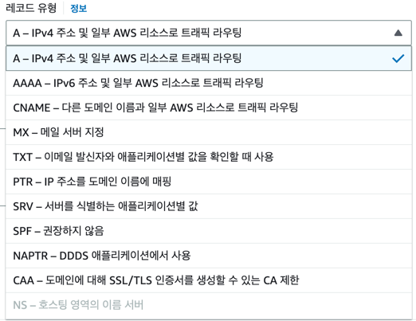
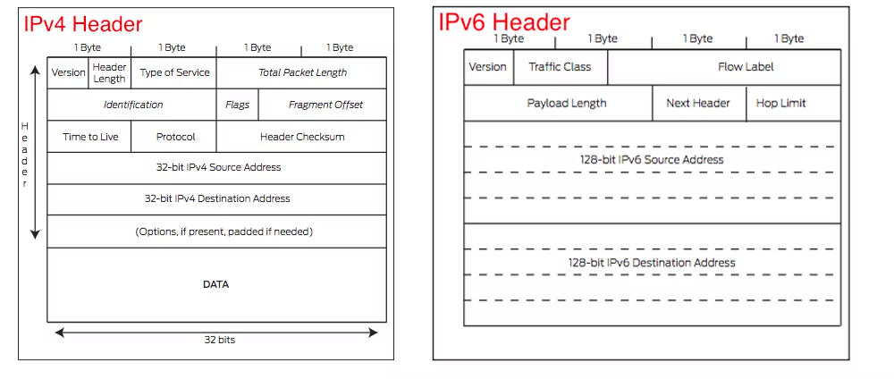

# 시작하며
AWS에서 제공하는 Route 53은 가용성과 확장성이 뛰어난 DNS 시스템이라고 설명하고 있습니다. Route 53은 사용자의 요청을 애플리케이션에 빠르게 연결합니다.
> **DNS(Domain Name Server)?**  
> 도메인 네임 서버는 사람이 읽을 수 있는 도메인 이름(www.naver.com)을 기계가 읽을 수 있는 IP 주소(1.2.3.4) 로 변환하는 역할을 합니다.

# Route 53 레코드 유형
Route 53에서 레코드를 생성하려고 하면 아래 이미지와 같이 레코드 유형을 선택해야 합니다. 각 유형은 어떻게 다르며 적절한 레코드 유형을 선택하는 방법에 대해 알아봅니다.  

## 기억해두기
- `A`: IPv4를 사용하여 리소스로 연결
- `AAAA`: `A`와 같은 용도지만 IPv6 사용
- `CNAME(Canonical Name Record)`: 하나의 도메인 네임을 다른 이름(별칭)으로 매핑시키는 레코드 (서브 도메인)
  - 하나의 IP 주소로부터 여러 개의 서비스를 실행할 때 관리하기 편함

> **IPv4 VS IPv6**  
> IPv6는 최신 세대 인터넷 프로토콜(IP) 입니다. (~~구조가 다른데 어떻게 다른거지?~~)
> IPv6는 인터넷 구성, 유지보수 및 보안 기능의 개선을 제공하면서 훨씬 큰 IP 주소 풀을 사용해 높은 확장성을 제공하도록 설계되었습니다. 속도 측면에서도
> 이론적으로 IPv6가 빠르다고 알려져 있지만 더 큰 패킷사이즈로 인해 일부 사용 사례에서는 IPv4보다 느릴 수 있습니다.
> 
