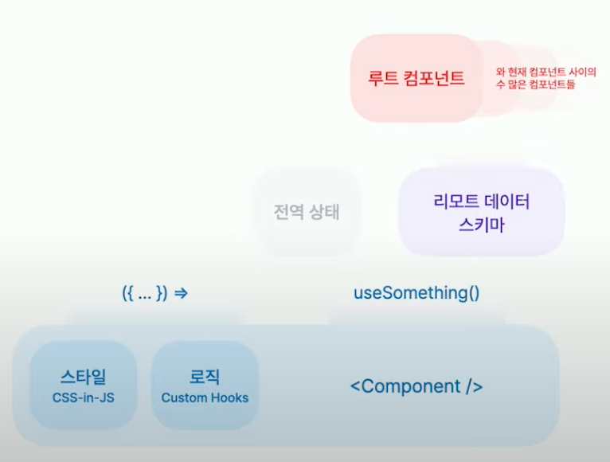

# 컴포넌트, 다시 생각하기
```
React 컴포넌트의 의존성: ?  
React 컴포넌트를 만들려면 ?가 필요하다.
```
1. 기능적Type 분류: props, hooks
2. 특징적Feature 분류: 스타일, 로직, 전역상태, 리모트 데이터 스키마
> **리모트 데이터 스키마 ?**  
> API 서버에서 내려주는 데이터의 모양

## 함께 두기 (Co-locate)
비슷한 관심사라면 가까운 곳 함께 두기  

```typescript
import React from 'react'

import styled from '@emotion/styled'

const Something: React.FC = () => {
  const { ... } = useHooksForSomething()
  
  return <Container>Hello, World</Container>
}

// 로직(Custom Hooks)
function useHooksForSomething() {
  // ...
}

// 스타일(CSS-in-JS)
const Container = styled.div`
  background-color: red;
`
```

id 값만 Props로 전달받아 다른 컴포넌트 간의 의존성 줄이기
```typescript
import { IArticle } from '~/api'

interface Props {
  article: IArticle
}
const Something: React.ExoticComponent<Props> = (props) => {
  return (
    <div>
      <h1>{props.article.title}</h1>
    </div>
  )
}
```

```typescript
import { useArticle } from '~/store'

interface Props {
  articleId: string
}
const Something: React.ExoticComponent<Props> = (props) => {
  return (
    <div>
      <h1>{article.title}</h1>
    </div>
  )
}
```

## 데이터를 ID 기반으로 정리하기
데이터 정규화(Nomalization)
```javascript
{
  entities: {
    articles: {
      '123': {
        id: '123',
        author: '1',
        title: 'blog post',
        comments: ['325']
      }
    }
  }
}
```
> 데이터 정규화는 [normalizr](https://github.com/paularmstrong/normalizr) 패키지를 사용해 쉽게 할 수 있다.

# 마치며
지난번에 봤던 FEConf 강의 중 좋았던 강의를 정리해보았는데 역시 어렵다. 이런 컴포넌트 분리의 기준은 프로젝트마다 다르기 때문에 많이 경험해보고 직접 분리하는 과정도 많이 겪어봐야 더 와닿을 것 같다. 
## Refer
https://www.youtube.com/watch?v=HYgKBvLr49c
