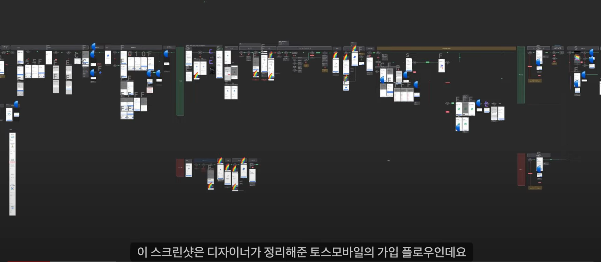
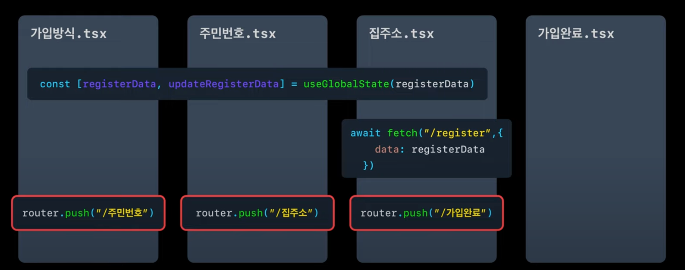
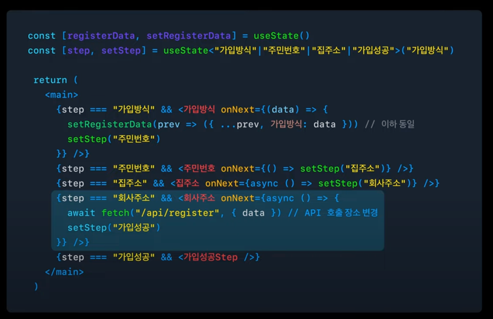
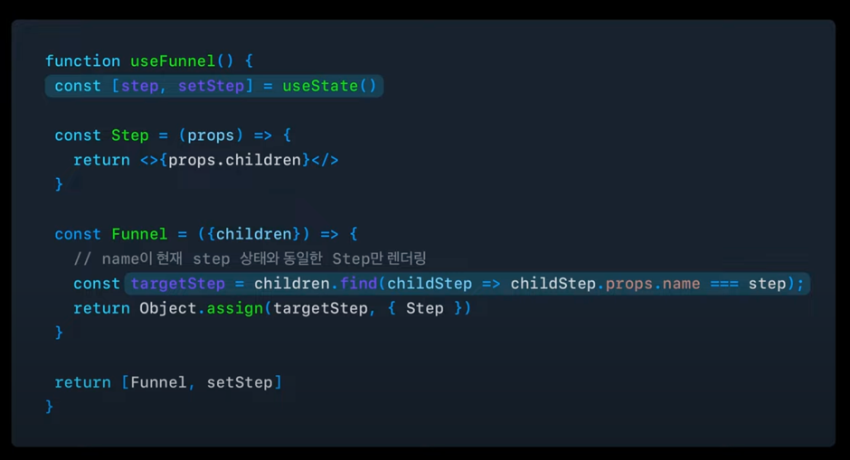
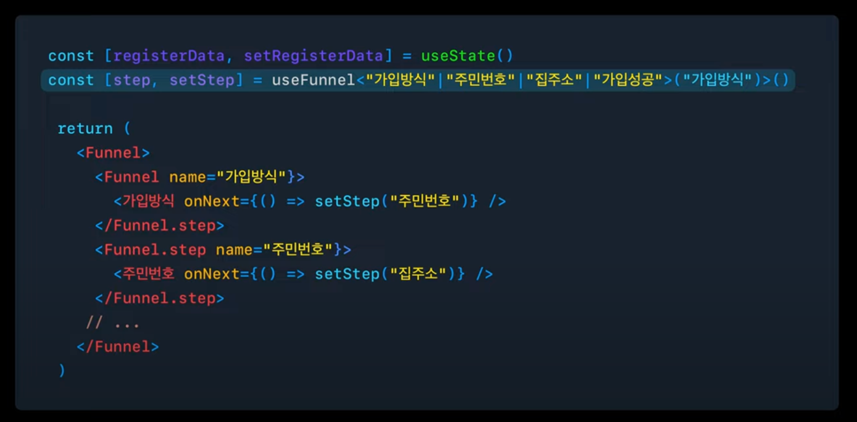
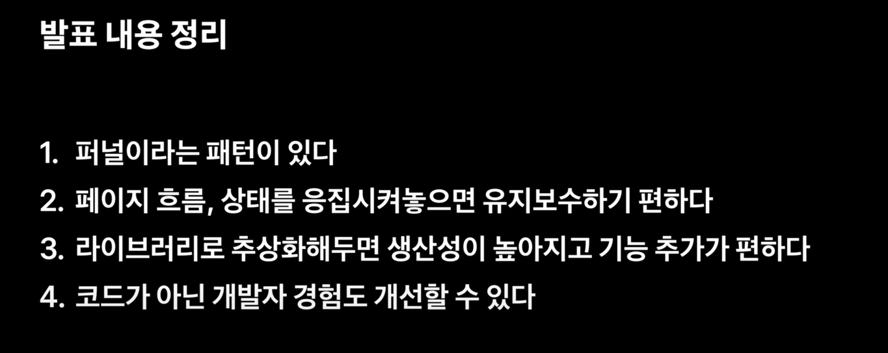

## 목차
1. [시작하며](#시작하며)
2. [토스는 어떨까?](#토스는-어떨까)
3. [쏟아지는 페이지 한 방에 관리하기](#쏟아지는-페이지-한-방에-관리하기)
4. [Reference](#reference)

# 시작하며
새로운 서비스를 만들어간지 6개월 쯤 되었을 때 점점 거대해지는 프로젝트를 보고 고민이 들었어요. 30%의 기능만이 구현된 지금도 헤비하다는 생각이 드는데
앞으로 더 커질 서비스를 생각하니 잠깐 아득해졌어요. 신규 기능이 나날이 살을 붙여가는 토스 앱의 경우 어떤 식으로 프로젝트를 관리하고 있는지 궁금하기도 했고요.

마침 작년 SLASH23에서 관련 주제로 발표했던 내용이 있었는데 관심있던 내용이라 재미있게 듣고 기록까지 해봅니다. 

# 토스는 어떨까?

토스 모바일 가입 플로우라고 합니다. 가입 단계만 해도 어마어마하게 많은 스크린이 존재하는 것을 볼 수 있는데요. 토스의 경우 한 페이지에서 유저가 할 수 있는 최소한의
기능만을 보여주고 단계 별 화면 전환을 시키고 있어 더 많은 스크린이 존재할 수 밖에 없겠다 생각했어요.

저는 피그마 화면 별로 새로운 스크린을 만들고 있어 사실 동일한 스크린에서 분기 처리만 잘해줘도 되는 상황임에도 무자비하게 스크린을 나누고 있었다는 생각이 들었습니다.

# 쏟아지는 페이지 한 방에 관리하기
발표에서는 토스 모바일의 회원가입 퍼널을 가장 기초적인 방법으로 개발하고 응집도, 추상화, 시각화의 단계를 거쳐 개선하는 과정을 보여줍니다.  
아래와 같은 가입 절차가 있다고 했을 때, 가장 정석적인 방법으로 각 단계 별로 파일을 만들고 마지막 단계인 주소입력 단계에서 가입 API를 호출하고 있습니다. 
발표자는 이 구조에서 두 가지 문제점을 집어 냈습니다.
1. 흩어져 있는 페이지 흐름: 가입 완료 절차를 확인하여야 할 때 총 3개의 파일을 확인하여 플로우를 따라가야 한다는 어려움
2. 흩어져 있는 상태: 전역 상태로 이루어져 있어 상태를 사용하는 곳과 수집하는 곳이 상이

위 문제들을 해결하기 위해 이제 응집도 개선의 단계를 거칩니다. 응집도를 개선할 때는 '연관된 코드는 가까운 곳에 배치하자' 라는 목적을 갖고 개선한다고 하네요.
## 응집도 개선하기
가입 Funnel을 하나 두고 그 구조는 아래와 같은 형태로 개선해 볼 수 있어요. 이렇게 되면 각 상태가 어떤 단계에서 업데이트 되는지와 페이지 흐름을 한 파일에서 확인할 수 있다는
장점이 존재합니다.

이렇게 응집되어 있는 코드로 개선 되었다면 이 퍼널 구조를 가입 절차가 아닌 다른 기능에서도 사용하려고 라이브러리로 추상화하는 단계를 거칩니다.
## 라이브러리로 추상화
useFunnel이라는 커스텀훅을 만들고 이를 기존 가입 퍼널에 적용한다면 아래와 같은 모습이 됩니다.

## Funnel Debugger..
라이브러리화만 잘 되어 있어도 충분하다고 생각했는데.. 여기서 한 발 더 나아가 DX를 경험하기 위해 Debugger를 만들었다고 합니다. 
각 Funnel의 스텝을 완전히 외우고 있지 않아도 개발자 도구를 통해 퍼널의 전체 스텝을 확인할 수 있고 원하는 스텝을 클릭했을 때 해당 스텝으로 이동할 수 있는 기능이
담겨져 있다고 하네요. (진짜 편할 듯 ..)  
이 Funnel Debugger는
1. 개발 및 디버깅 속도 상승
2. 퍼널이 의도된 흐름으로 짜여있는지 코드를 보지 않고 파악
3. 퍼널의 흐름을 비개발자 동료에게 공유

위 세가지 측면에서 큰 도움을 줄 거라고 합니다. 다이어그램으로 시각화되어 있는 부분은 [Mermaid](https://mermaid.js.org/)라는 라이브러리를 통해 구현

# 마치며

# Reference
https://youtu.be/NwLWX2RNVcw?si=TOXeeWaSSNbAr6-b
