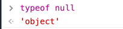
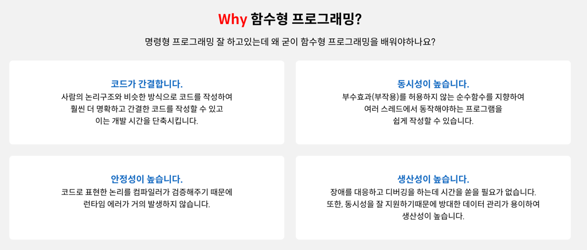

## 프로그래밍
프로그래밍이란 컴퓨터에게 실행을 요구하는 일종의 커뮤니케이션이다. 문제를 명확히 이해하고 적절한 해결 방은을 찾아 기계가 실행할 수 있을 정도로 요구를 설명하는 작업이며, 이 결과물이 바로 코드이다.

## 컴파일러와 인터프리터
프로그래밍 언어를 사용해 프로그램을 작성 후 컴퓨터가 이해할 수 있는 기계어로 변환해주는 번역기를 컴파일러(Compiler) 혹은 인터프리터(Interpreter)라고 한다.

## 자바스크립트의 특징
웹을 구성하는 요소 중 하나로 웹 브라우저에서 동작하는 유일한 프로그래밍 언어이다. 자바스크립트는 개발자가 별도의 컴파일 작업을 수행하지 않는 **인터프리터 언어**이다.
자바스크립트는 런타임에 컴파일되며 실행 파일이 생성되지 않고 인터프리터의 도움 없이 실행할 수 없기 때문에 컴파일러 언어라고 할 수는 없다.

## 변수
변수는 값을 저장하기 위해 확보한 메모리 공간 자체 또는 그 공간을 식별하기 위해 붙인 이름을 말한다.

## 식별자
변수의 이름을 식별자(Identifier)라고도 한다. 식별자는 값이 아닌 메모리의 주소를 기억하고 있다. 변수 뿐만 아니라 함수, 클래스 등 메모리 상에 존재하는
값을 식별할 수 있는 이름은 모두 식별자라고 부른다.

## 자바스크립트 타입
- Number
- String
- Boolean
- Object
- Symbol
- Function
- undefined
- BigInt..?
> null은 object 타입이다.  


## 스코프
### 함수 레벨 스코프
`var` 키워드로 선언한 경우 함수 레벨 스코프. 즉, 오로지 함수의 코드 블록만 지역 스코프로 인정합니다.
```javascript
var foo = 1;

{
    var foo = 10;
}
console.log(foo) // 10 의도치 않는 변경
```
### 블록 레벨 스코프
`let` 키워드를 통해 선언된 변수는 블록레벨 스코프를 따릅니다.
```javascript
let foo = 1;

{
    let foo = 2;
}
console.log(foo) // 1
```

## task queue
콜 스택에 들어가기 전 setTimeout, 사용자 이벤트 콜백 등이 저장되는 큐

## microtask queue
Promise.then 콜백이 저장되는 큐

## 이벤트 루프 ?
### 정의
메인 스레드 동작 타이밍을 관리하는 관리자 역할. 메인 스레드란 자바스크립트 코드 실행이나 브라우저 렌더링을 맡는 등 브라우저의 주된 동작이 수행되는 곳이다.
### 중요한 이유
**1. 브라우저 동작의 대부분이 메인 스레드에서 싱글 스레드로 실행된다.**

브라우저 렌더링을 포함하여 비동기 함수를 제외한 대부분의 자바스크립트는 메인 스레드라는 곳에서 실행된다.

싱글 스레드가 하나의 작업을 하고 있다면 다른 작업은 지연시키게 된다. 메인 스레드에서도 마찬가지로 싱글 스레드 작업이 이루어지는 동안 다른 작업들을 지연시키기 때문에 싱글 스레드 작업 관리는 매우 중요하다.
> 브라우저의 탭 마다 다른 프로세스로 동작됩니다.

**2. 메인 스레드는 이벤드 루프에 의해 관리된다.**  
메인 스레드와 같은 싱글 스레드에서 하나의 작업이 오랫동안 실행되는 것을 방지하기 위해 어떤 작업을 우선으로 동작시킬 것인가 결정하는 것이 매우 중요하다.

이러한 컨트롤을 이벤트 루프가 하는 것이다.

### 동작
1. 콜 스택에 쌓여있는 task 정리
2. microtask queue에 등록된 Promise.then 콜백 실행
3. 화면 갱신이 필요하다면 렌더링 파이프라인으로 이동
4. task queue의 콜백 하나씩 실행

[더보기](https://tecoble.techcourse.co.kr/post/2021-08-28-event-loop/)


## 블로킹 VS 논블로킹
파이썬은 블로킹 언어이고 자바스크립트는 논블로킹 언어입니다. 자바스크립트는 연산이 끝나는 것을 기다리지 않아도 되기 때문에 비동기적 작업이 가능합니다. 그래서 어떠한 작업이 끝나고 이뤄져야 하는 작업들은 `async/await` 나 콜백함수를 사용해야 합니다.

## 자바스크립트의 이벤트 루프
자바스크립트는 기본적으로 싱글 스레드 이벤트 루프 형태입니다.  
자바스크립트는 Stack과 Queue를 갖고 있는데 setTimeout 같은 함수들은 Queue(task queue)로 들어가게 되고, 그 메시지가 실행되어야하는 상황에 Stack이 비어있다면 실행 됩니다.

## Hosting
자바스크립트에서 선언문들이 최상위로 끌어올려지는 것을 의미합니다.
[더보기](JavaScript/호이스팅.md)

## 클로저
클로저란 자신이 생성될 때의 환경을 기억하는 함수로, 외부 변수를 기억하고 그 변수에 접근할 수 있는 함수를 뜻합니다.
자바스크립트는 중첩 함수로 쉽게 클로저를 구현할 수 있습니다.  
원래 함수 내부 변수를 스코핑할 때는 렉시컬 스코핑을 따라서 그 전역 변수에 있는 값을 참조하게 됩니다. 하지만, 함수 내부에
다른 함수를 위치시킴으로서 내부 함수가 감싸는 environment를 참조하게 되고, 값을 저장하는 것이 가능하게 됩니다.
```javascript
var color = 'red'; 
function foo() { 
    var color = 'blue'; // 2 
    function bar() { 
        console.log(color); // 1 'blue'
    } 
    return bar; 
} 
var baz = foo(); // 3 
baz(); // 4 undefined
```
[더보기](JavaScript/closure.md)

## This
자바스크립트는 `this`라는 객체를 갖게 되는데, `this`는 호출된 상황에서 함수를 소유하고 있는 객체를 의미합니다.
전역 환경에서 `this`를 쓰게 되면, 그것은 `window` 객체를 의미합니다.

- `apply`: 메서드는 첫 번째 인자로 `this` 대상 객체를 보내고 두번째 인자로 배열이 온다.
- `call`: 메서드는 첫 번째 인자로 `this` 대상 객체를 보내고 두번째 인자로 배열이 아닌 일반 변수가 온다.
- `bind`: 메서드는 당장 호출되지 않고 함수가 리턴되는 형태로 필요한 때에 호출할 수 있다.

> `apply`, `call`, `bind`를 통해 `this`를 주입 혹은 추출이 가능하다.

## async/await
자바스크립트에서 Promise를 쉽게 사용하기 위한 것으로 비동기 작업을 할 때 사용되고, 콜백 hell이나 무한 then과 같은 보기 안좋은 코드를 깔끔하게 표현할 수 있습니다.

## 비제어 컴포넌트
> 보통은 [제어 컴포넌트](https://ko.reactjs.org/docs/forms.html#controlled-components) 를 사용하는 것이 좋습니다. 제어 컴포넌트의 폼 데이터는 React 컴포넌트에서 다뤄지고 대안인 비제어 컴포넌트는 DOM 자체에서 폼 데이터가 다루어집니다.

- 비제어 컴포넌트는 `setState`로 폼 데이터를 관리하지 않고 `ref`를 통해 관리합니다.
- `defaultValue`를 통해 초기값을 지정할 수 있습니다. (checkbox, radio는 `defaultChecked`)
- https://ko.reactjs.org/docs/uncontrolled-components.html
- file input 컴포넌트는 항상 비제어 컴포넌트 입니다.

## 함수형 프로그래밍과 가장 밀접한 메서드
> **함수형 프로그래밍이란 ?**  
> 함수와 데이터 중심으로 코드를 짜는 것.  
> 함수형 프로그래밍은 거의 모든 것을 순수 함수로 나누어 문제를 해결하는 기법으로, 작은 문제를 해결하기 위한 함수를 작성하여 가독성을 높이고 유지보수를 용이하게 해준다. 출처: https://mangkyu.tistory.com/111 [MangKyu's Diary]



함수형 프로그래밍의 궁극적인 목표는 부수효과 (Side Effect), '원본 데이터의 변경없이' 코드를 짜는 것이고, 불변성을 지키는 메서드들이 이에 속합니다.
- 순수함수 (동일한 인자에 대해 항상 동일한 결과를 반환해야 한다)
- 부순물 X (파라미터에 있는 변수들만 사용)
- 함수와 데이터 중심

- `map`
- `filter`
- `reduce`

## 커스텀훅을 만들 때 제약조건

## jquery와 React 차이
React는 Virtual DOM을 사용하기 때문에 렌더링 되는 횟수가 적어 빠르게 느껴집니다.

## 이벤트 중복 호출을 방지하기 위한 WebAPI
`stopPropagation` 을 통해 이벤트 버블링/캡쳐링을 방지할 수 있습니다.
한 요소에 여러 개의 이벤트가 등록되어 있을경우 `stopPropagation` API를 사용해도 두개의 이벤트가 실행됩니다. 만약 하나의 이벤트만 실행되어야
한다면 `stopImmediatePropagation` API를 사용해야 합니다.
- 이벤트가 두개 등록되어 있다면 어떤 것이 먼저 실행되는지 알아보기

## function과 arrow function
- this: function은 전역 객체(window), arrow function은 상위 스코프의 this를 가르킵니다.
- arguments: arrow function은 arguments를 사용할 수 없음
- prototype: arrow function은 prototype을 사용할 수 없음

## CSS-in-JS VS CSS-in-CSS

## Redux, recoil 공통점, 차이점

- 함수형 프로그래밍과 가장 밀접한 메소드
- 커스텀훅을 만들 때의 제약조건
- jquery와 리액트 차이
- commonJs 뭐더라..
- 이벤트 중복 호출을 방지하기 위한 WebAPI
    - Stopimmediatepropagation API
    - 이벤트가 두개 등록되어 있을때 어떤게 실행될까?
- function과 arrow function의 차이
- CSS-in-JS VS CSS-in-CSS
- Redux, recoil 다른 점
- Rx, Observable
- CSS, JS로 해결할 수 있는 경우 CSS를 사용하면 좋은 이유
  git / jenkins 관련 질문
  babel의 역할과 사용 이유
  webpack의 역할과 사용 이유
  jquery / react 차이점
  네이버에 접속할 때 렌더링 되는 과정
  렌더링 과정을 직접 확인할 수 있는 방법
  서비스에 속도 문제가 발생될 때 해결할 수 있는 방법
  데이터 전달되는 과정
  tcp / http 차이점
  함수 선언식 / 함수 표현식 차이점
  csr / ssr 관련 질문
  csrf란?
  hooks 관련 질문
  레이아웃과 관련된 css 요소들이 무엇이 있는지?
  this 관련 질문
  브라우저가 es6버전 이후로 생겨진 기능들을 읽지 못하는 이유
  script태그가 body위와 body아래에 있을 때 차이점
  position의 relative와 absolute 속도 비교
- keep-alive란?
  this란?
  hooks에는 종류가 무엇이 있고 사용해본 것은 어떤 것이 있는가?
  useEffect 관련 질문
  useCallback 관련 질문
  useState 사용 방법
  tcp / udp 차이점
  http버전 관련 질문
  prototype이란?
  oop란?
  lazyLoading이란?
  본인의 성격은 어떤것 같은지?
  주변 사람들이 본인을 어떻게 바라보는지?
  성장이란?
  closure란?
  closure 장단점
  index란?
  사용해본 database
  procedure란?
  aop란?
  회사들을 지원할 때 어떤 걸 보고 지원 해왔는지?
  css display 종류
  display의 inline / none 차이점
