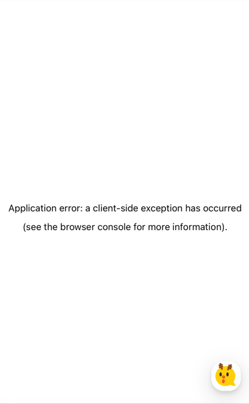

# 시작하며
Next.js 웹 애플리케이션 환경에서 아래 이미지와 같은 에러가 종종 발생합니다. 아래 에러 조치의 일환으로 [Error boundary]()와 Setnry를
설정합니다.


# Sentry Setup
1. 센트리에서 프로젝트 생성  
   센트리 페이지에서 플랫폼을 설정하면 플랫폼에 따라 자동으로 기본적인 세팅을 할 수 있는 커맨드가 생성됩니다.  
**[sentry/wizard 설정]**
   - sentry.client.config.js, sentry.server.config.js 생성
   - Next.js config 파일인 next.config.js 파일에 센트리 관련 설정 업데이트
   - sentry-cli 를 위한 .sentryclirc, sentry.properties 파일 생성
   - Sentry setup을 확인할 수 있는 example page 생성

2. SDK wizard로 기본적인 세팅
```shell
npx @sentry/wizard@latest -i nextjs
```
