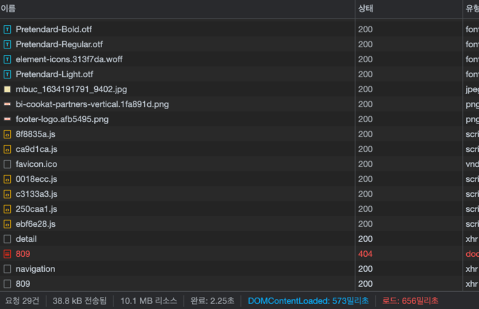

# 시작하며
회사에서 커머스 입점몰 사이트를 개발하고 있다. 상품 정보가 워낙 다양한 정보가 많기 때문에 복잡한 상품일수록 상세 페이지를 불러오는 속도가 느리다는 생각이 들어 이 부분을 최적하 해보기로 결심했다.

# 최적화 전
  
흠.. 왜 7.99초나 걸렸는지 알 수 없다. 캐시 비우기 및 강력 새로고침 시에는 이정도가 걸리는 것 같고
  
일반 새로고침 시에는 2.25초 정도 걸리는 듯 하다.
