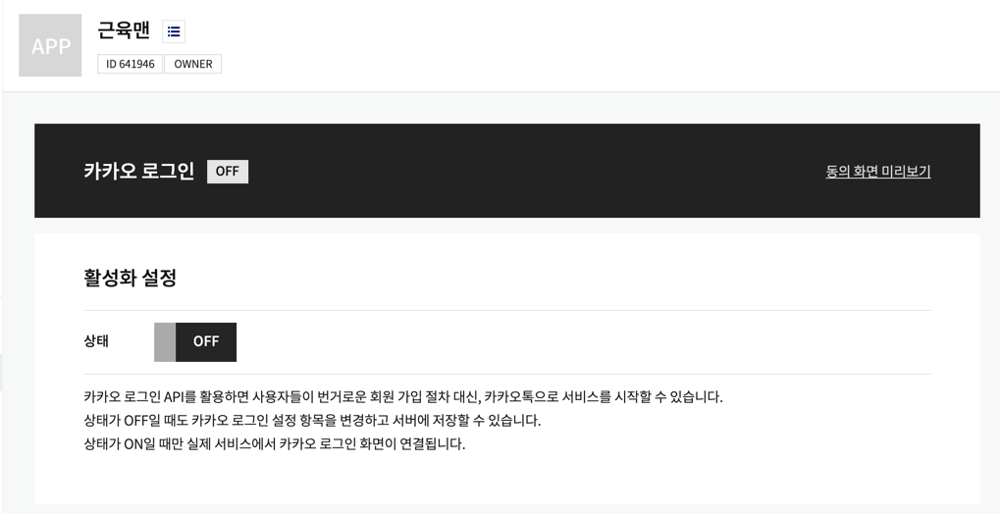
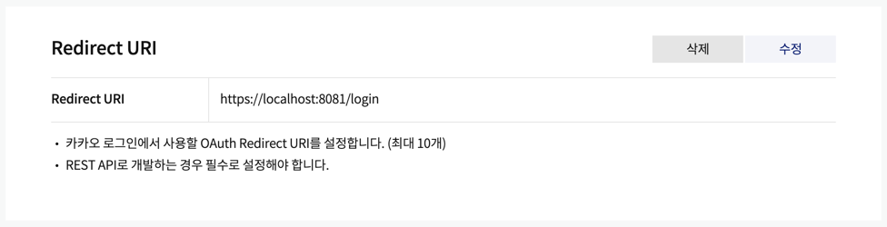
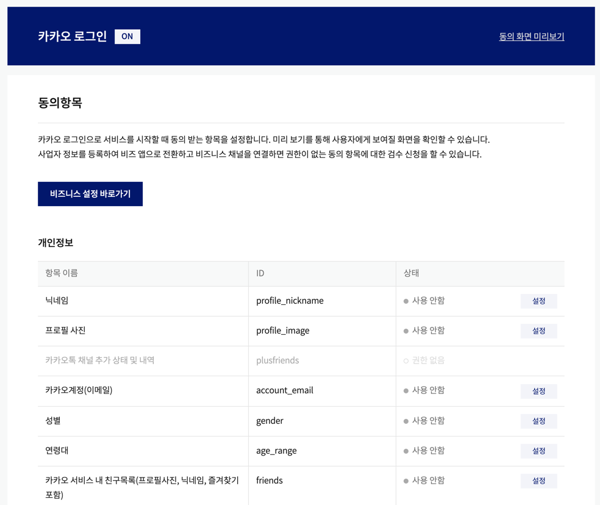
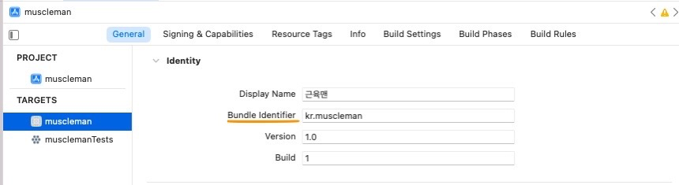
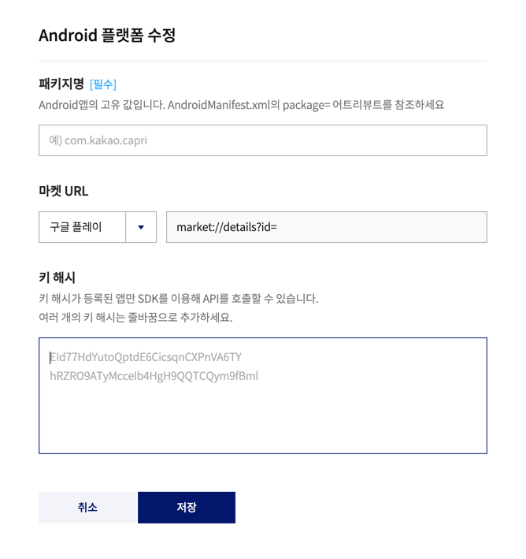

# 시작하며
[근육맨](https://github.com/jiyaaany/muscleman) 이라는 모바일 어플리케이션 프로젝트를 진행하며 개발 언어로 **[React Native](https://reactnative.dev/)** 를 채택했고, 소셜 로그인 기능을 추가하게 되었다.
>[사전 준비]  
RN >= 0.60 (RN <= 0.59의 경우 패키지 설치법이 상이할 수 있습니다.

# 카카오
## 애플리케이션(프로젝트) 추가
1. 먼저 [Kakao Developers](https://developers.kakao.com/) 사이트에 접속해 **내 애플리케이션** 메뉴에서 애플리케이션 추가를 해줍니다.

1-1. 앱 이름, 사업자명 입력 시 간단히 애플리케이션을 생성할 수 있습니다.

2. 기본값으로 카카오 로그인이 비활성화 되어 있기 때문에 애플리케이션 > 카카오 로그인 메뉴에서 활성화 시켜줍니다.

3. 카카오 로그인 활성화 부분 하단에 있는 Redirect URI를 설정해줍니다. 공식 문서에서는 아래 두가지의 규칙을 지켜 Redirect URI를 설정해야 한다고 가이드하고 있습니다.
- Redirect URI는 HTTP/HTTPS 프로토콜 및 80, 443 포트를 허용합니다.
- Redirect URI는 HTTP/HTTPS 프로토콜을 구분하므로 각각 등록해야 합니다.

4. 애플리케이션 > 카카오 로그인 > 동의항목 메뉴에 접속하여 카카오 로그인 시 제공 받을 데이터들을 설정할 수 있습니다. 아래 개인정보 테이블에서 제공받을 항목을 설정하고 우측 상단의 **동의 화면 미리보기** 버튼을 통해 카카오 로그인 시 노출되는 모달을 확인해볼 수 있습니다.


## 패키지 설치
저는 [React Native 카카오 로그인 패키지](https://github.com/react-native-seoul/react-native-kakao-login) 를 사용해 연동을 진행해보려고 합니다.
```
yarn add @react-native-seoul/kakao-login
```
iOS의 경우 아래 명령어로 pod 라이브러리 설치가 별도로 필요합니다.
```
npx pod-install
```
## iOS 세팅
### 설정 파일 변경
먼저 `ios` 디렉토리 하위의 `info.plist` 설정파일을 수정해줍니다.
```xml
<key>CFBundleURLTypes</key>
<array>
    <dict>
        <key>CFBundleTypeRole</key>
        <string>Editor</string>
        <key>CFBundleURLSchemes</key>
        <array>
          <string>kakao{앱 아이디}</string>
        </array>
    </dict>
</array>

<key>KAKAO_APP_KEY</key>
<string>{앱 아이디}</string>
<key>LSApplicationQueriesSchemes</key>
<array>
    <string>kakaokompassauth</string>
    <string>storykompassauth</string>
    <string>kakaolink</string>
</array>
```

### [Swift Bridging Header](https://stackoverflow.com/questions/31716413/xcode-not-automatically-creating-bridging-header) 추가
[패키지 공식문서](https://github.com/react-native-seoul/react-native-kakao-login) `README.MD`에 소개된 것처럼 위 링크를 통해 `Swift Bridging Header`를 추가합니다.
먼저 Xcode에서 `프로젝트 디렉토리/ios` 경로를 열어줍니다. (로딩하는데 한 세월 걸림..)

### `AppDelegate.m`
다음으론 카카오톡 앱이 깔려있을 경우 올바른 데이터를 받아오기 위해 `AppDelegate.m` 파일에 아래 내용을 추가해줍니다. 
```
// import
#import <RNKakaoLogins.h>

// openURL 함수 추가
- (BOOL)application:(UIApplication *)app
     openURL:(NSURL *)url
     options:(NSDictionary<UIApplicationOpenURLOptionsKey,id> *)options {
 if([RNKakaoLogins isKakaoTalkLoginUrl:url]) {
    return [RNKakaoLogins handleOpenUrl: url];
 }

 return NO;
}

dispatch_async(dispatch_get_global_queue( DISPATCH_QUEUE_PRIORITY_DEFAULT, 0), ^(void){
      dispatch_async(dispatch_get_main_queue(), ^(void){
        if ([RNKakaoLogins isKakaoTalkLoginUrl:url]) {
          [RNKakaoLogins handleOpenUrl: url];
        }
      });
  });
```

### Bundle Identifier 확인
Xcode에서 Project => Targets 아래 선택 후 General 탭으로 이동하여 Bundle Identifier가 본인의 카카오 앱과 동일한지 확인합니다.


## Android
### 키 해시(Key Hash) 등록
[링크](https://developers.kakao.com/docs/latest/ko/getting-started/sdk-android-v1#key-hash) 를 통해 키 해시등록을 진행합니다. 디버그, 릴리즈 키 해시 값을 등록하는 방법은 다음과 같습니다.
1. 운영체제에 따른 명령어를 통해 키 해시를 생성
2. [내 애플리케이션] > [플랫폼] > [Android 플랫폼 등록]
3. [키 해시] 항목에서 생성한 키 해시를 입력 후 저장  


#### 디버그 키 해시
```
keytool -exportcert -alias androiddebugkey -keystore ~/.android/debug.keystore -storepass android -keypass android | openssl sha1 -binary | openssl base64
```
React Native 0.60.x 부터 기본적으로 디버깅 키 해시가 포함됩니다. `{PROJECT_DIR}/android/app` 경로에 `debug.keystore` 파일을 찾습니다. 아래 명령어를 통해 키 해시 값을 추출하고 카카오 개발자 사이트에 등록해줍니다.
```
keytool -exportcert -alias androiddebugkey -keystore ~./android/app/debug.keystore -storepass android -keypass android | openssl sha1 -binary | openssl base64
```

#### 릴리즈 키 해시
```
keytool -exportcert -alias <RELEASE_KEY_ALIAS> -keystore <RELEASE_KEY_PATH> | openssl sha1 -binary | openssl base64
```

### Manifest 파일 수정
`android/app/src/main/AndroidManifest.xml` 파일에서 `allowBackup`을 `true`로 변경해줍니다.
```
...
android:allowBackup="true"
...
```

### Redirect URI 설정
`android/app/src/main/AndroidManifest.xml`
```
<activity android:name="com.kakao.sdk.auth.AuthCodeHandlerActivity">
  <intent-filter>
      <action android:name="android.intent.action.VIEW" />
      <category android:name="android.intent.category.DEFAULT" />
      <category android:name="android.intent.category.BROWSABLE" />

      <!-- Redirect URI: "kakao{NATIVE_APP_KEY}://oauth“ -->
      <data android:host="oauth"
          android:scheme="kakao{카카오 네이티브 앱 key}" />
  </intent-filter>
</activity>
```

### `strings.xml` 파일 수정
```
<string name="kakao_app_key">{카카오 네이티브 앱 key}</string>
```

### kotlin을 해석가능하도록 수정
`android/build.gradle` 파일에서 다음과 같이 수정합니다.
```
 buildscript {
   ext {
     ...
     kotlinVersion = '1.3.41'
   }
   dependencies {
     ...
     classpath "org.jetbrains.kotlin:kotlin-gradle-plugin:$kotlinVersion"
   }
 }
```

# 구글
## 애플리케이션(프로젝트) 추가
구글도 마찬가지로 프로젝트를 생성합니다.


## 패키지 설치
[google-signin](https://github.com/react-native-google-signin/google-signin) 패키지를 설치합니다.
```
yarn add @react-native-google-signin/google-signin
```
