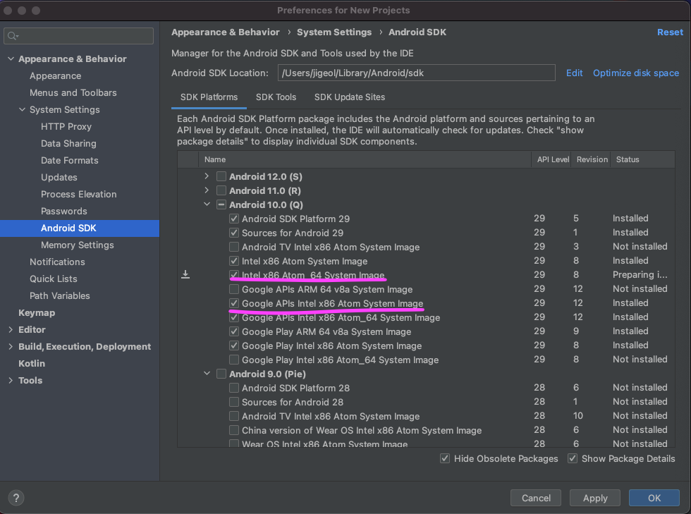
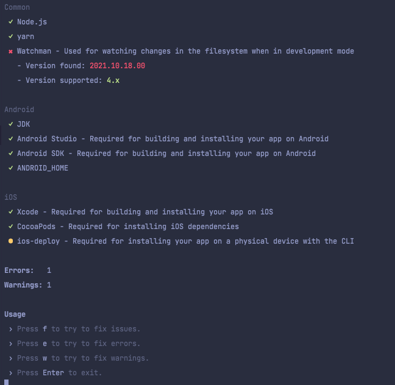
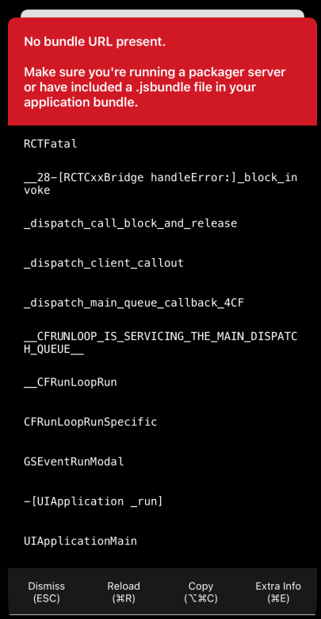

# 환경세팅
## 설치
```
brew install node
brew install watchman
brew install --cask adoptopenjdk/openjdk/adoptopenjdk8
```
## Android
### 1. 안드로이드 스튜디오 설치
[안드로이드 스튜디오](https://developer.android.com/studio/index.html) 를 설치하고 아래 항목들을 체크해준다.
- Android SDK
- Android SDK Platform
- Android Virtual Device
### 2. Android SDK 설치
안드로이드 스튜디오 SDK Manager에서 Android 10.0 버전을 체크하여 설치해준다.

- Inter x86 Atom_64 System Image or Google APIs Inter x86 Atom System Image
"SDK Tools" 탭으로 이동하여 아래 두가지 항목을 체크한 후 Apply 해준다.
- "Android SDK Build-Tools" 29.0.2 
- "Android SDK Command-line Tools (latest)"
### 3. `ANDROID_HOME` 환경 변수
```
vi ~/.zshrc
```

```
export ANDROID_HOME=$HOME/Library/Android/sdk
export PATH=$PATH:$ANDROID_HOME/emulator
export PATH=$PATH:$ANDROID_HOME/tools
export PATH=$PATH:$ANDROID_HOME/tools/bin
export PATH=$PATH:$ANDROID_HOME/platform-tools
```

아래 명령어를 통해 환경변수가 잘 지정되었는지 확인한다.
```
source ~/.zshrc
echo $ANDROID_HOME
```

# 명령어들
## 상태 확인
아래 명령어를 통해 환경 세팅이 잘되었는지를 확인할 수 있다.
```
npx @react-native-community/cli doctor
```
**[실행 결과]**


# 팁들
## 실행 오류
`yrun` 명령어를 통해 실행 시 오류나는 상황에 접하면 먼저 `Xcode`나 `Android Studio`를 통해 해당 디렉토리를 열어 빌드 후 원인을 찾는 것이 빠르고 친절하다.

## No bundle URL present

iOS 디바이스에서 No bundle URL present 에러가 발생할 경우 프로젝트 루트 디렉토리에서 다음 명령을 실행해 iOS 빌드 디렉토리를 삭제하고 세션(8081 포트)을 삭제한다.
```
rm -rf ios/build/; kill $(lsof -t -i:{PORT}); react-native run-ios
```
### Optional
다음 명령으로 Bash 구성파일 `.bashrc`에 추가하여 이러한 오류가 발생하지 않도록 한다.
```
echo "alias rni=\"kill \$(lsof -t -i:8081); rm -rf ios/build/; react-native run-ios\"" >> ~/.bashrc; source ~/.bashrc
```

## Android 실행 오류
```
General error during semantic analysis: Unsupported class file major version 60
```

### 원인
위 오류의 원인은 jdk 버전이 지원되지 않는 버전이라서 발생한다. jdk 여러 버전이 설치 되어있는 경우 버전을 명시해주지 않으면 이런 오류가 발생할 수 있다. (이때의 경우 jdk 16 버전으로 지정되어 있었다.)

### 해결
1. 설치되어있는 jdk 버전 확인
```
/usr/libexec/java_home -V

Matching Java Virtual Machines (3):
16.0.2 (x86_64) "Oracle Corporation" - "OpenJDK 16.0.2" /Users/jigeol/Library/Java/JavaVirtualMachines/openjdk-16.0.2/Contents/Home
15.0.4 (x86_64) "Azul Systems, Inc." - "Zulu 15.34.17" /Users/jigeol/Library/Java/JavaVirtualMachines/azul-15.0.4/Contents/Home
1.8.0_292 (x86_64) "AdoptOpenJDK" - "AdoptOpenJDK 8" /Library/Java/JavaVirtualMachines/adoptopenjdk-8.jdk/Contents/Home
/Users/jigeol/Library/Java/JavaVirtualMachines/openjdk-16.0.2/Contents/Home
```

2. jdk 버전 변경
```
export JAVA_HOME=$(/usr/libexec/java_home -v 1.8)
```
3. 변경된 버전 확인
```
java -version
openjdk version "1.8.0_292"
OpenJDK Runtime Environment (AdoptOpenJDK)(build 1.8.0_292-b10)
OpenJDK 64-Bit Server VM (AdoptOpenJDK)(build 25.292-b10, mixed mode)
```

# React Native Absolute imports
```typescript
// AS-IS
import foo from '../../../../../foo';

// TO-BE
import foo from 'src/foo'
```

1. 패키지 설치
```
ya -D babel-plugin-module-resolver
```
2. `babel.config.ts`
```typescript
plugins: [
[
  'module-resolver',
  {
    root: ['.'],
    extensions: [
      '.ios.ts',
      '.android.ts',
      '.ts',
      '.ios.tsx',
      '.android.tsx',
      '.tsx',
      '.jsx',
      '.js',
      '.json',
    ],
    alias: {
      '@src': './src',
    },
  },
],
```
3. `tsconfig.json`
```typescript
"baseUrl": "./src",
 "paths": {
   "@src/*": ["./*"]
 },    
```
4. 캐시 비우고 재시작
```
yst --reset-cache
```

# React Native 앱 이름 변경
1. `app.json` 파일 수정
```typescript
{
  "displayName": "{APP_NAME}"
}
```
2. `strings.xml` 파일 수정
```typescript
<string name="app_name"> { APP_NAME }</string>
```
3. `Info.plist` 파일 수정
```
<key>CFBundleDisplayName</key>
<string>{APP_NAME}</string>
```
