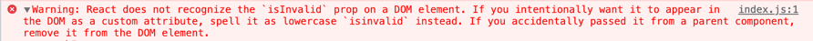

# unknown prop 경고
## 오류코드

```javascript
React does not recognize the `isInvalid` prop on a DOM element. If you intentionally want it to appear in the DOM as a custom attribute, spell it as lowercase `isinvalid` instead. If you accidentally passed it from a parent component, remove it from the DOM element.
```
## 원인

# React 절대 경로 설정
import 구문을 상대 경로로 지정할 경우 파일이 이동되거나 등의 이벤트가 발생했을 때 오류가 발생할 수 있기 때문에 절대 경로로 변경하여 사용한다.
## 해결방법
### tsconfig.json
```typescript
{
  "compileOptions": {
    "baseUrl": "src"
  },
  "include": ["src"]
}
```

# import문 정렬
import문이 길어질 경우 가독성을 위해 우선순위를 설정하여 정렬한다. [eslint-plugin-import](https://github.com/import-js/eslint-plugin-import) 패키지의 `import/order`을 사용한다.
1. 설치
```
ya eslint-plugin-import -g
```
2. 설정
```

```
