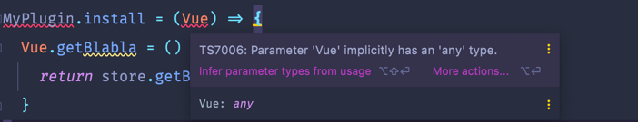

# 시작하며
매 프로젝트를 구축할 때마다 하는 고민 **'공통 모듈을 어떻게 관리할까?'**. 이번 프로젝트를 진행하면서도 어김없이 이 질문에 대한 고민을 해보았다. 규모가 꽤 있는 Vue 프로젝트를 시작 단계부터 참여했던 경험이 없었기 때문에 여러 아티클을 찾아보았다.

> **[환경]**   
Vue2 + Nuxt.js

# 플러그인으로 작성하기
Vue 공식문서에서는 [플러그인](https://kr.vuejs.org/v2/guide/plugins.html)에 대해 설명하고 있다. 공통으로 사용할 js 파일을 `/assets` `/plugins` 이나 선호하는 곳에 만들어준다.

```typescript
import Vue from 'vue'
import { store } from "~/store";

Vue.use(MyPlugin)

MyPlugin.install = (Vue) => {
  Vue.getBlabla = () => {
    return store.getBlabla
  }
}
```
사용은 이렇게
```typescript
this.$getBlabla()
```

위 방법대로 시도하다보니 Typescript의 벽에 부딪혔다. 파라미터로 받아오는 Vue에 대한 타입을 지정하라고 하는데 `any`는 절대 쓰기 싫어서 ,, 다른 방법을 찾아보았다.


[Nuxt Typescript](https://typescript.nuxtjs.org/cookbook/plugins/) 공식 문서에서 plugins를 등록하는 가이드를 찾을 수 있었고 결과를 미리 말하자면 이 방법으로 성공했다 !! 💪🏻 **Vue 인스턴스에 주입하는 방법**과 **context에 주입하는 방법**이 있는데 공통 함수를 등록하는 경우엔 Vue 인스턴스에 주입해도 된다고 생각해서 첫 번째 방법으로 진행했다.

1. plugin 파일 생성
`nuxt` 프로젝트 디렉토리 구조의 `plugins` 라는 폴더 하위에 `{plugins파일명}.ts` 파일을 생성해준다. 
```typescript
import Vue from 'vue'

declare module 'vue/types/vue' {
  interface Vue {
    $myInjectedFunction(message: string): void
  }
}

Vue.prototype.$myInjectedFunction = (message: string) => console.log(message)
```

2. `nuxt.config.js` 파일 수정
```typescript
plugins: [
  ...중략...
   '~/plugins/{plugins파일명}'
],
```

3. 사용
```typescript
${함수명}()
```
 

## Refer  
> https://song8420.tistory.com/385?category=891243  
> https://kr.vuejs.org/v2/guide/plugins.html  
> https://typescript.nuxtjs.org/cookbook/plugins/

# 마치며
~~리서치 후 프로젝트에 적용하는 과정에서 Nuxt + TypeScript의 벽에 부딪혀 위 방법으로는 실패했다.. (조금 더 리서치가 필요하다.)~~  
함수 모듈을 만들다보니 아래와 같은 개선 포인트를 찾아낼 수 있었다.  

**1. A 컴포넌트, B 컴포넌트에서 동일한 로직을 구현해야하는 경우 유지보수가 쉽다.**

동일한 로직을 구현해놓고 추후 변경사항이 생겼을 때 컴포넌트에서 각각의 함수를 사용한다면 한 곳만 변경하는 등 놓치는 포인트가 생길 수 있다.

**2. 중복되는 코드를 제거하고 재사용이 가능하다.**  
**3. (추후) 각 기능별 공통함수를 담고있는 plugin 파일을 만든다면 특정 기능에서 사용되는 함수들을 한 파일에서 확인할 수 있다.**