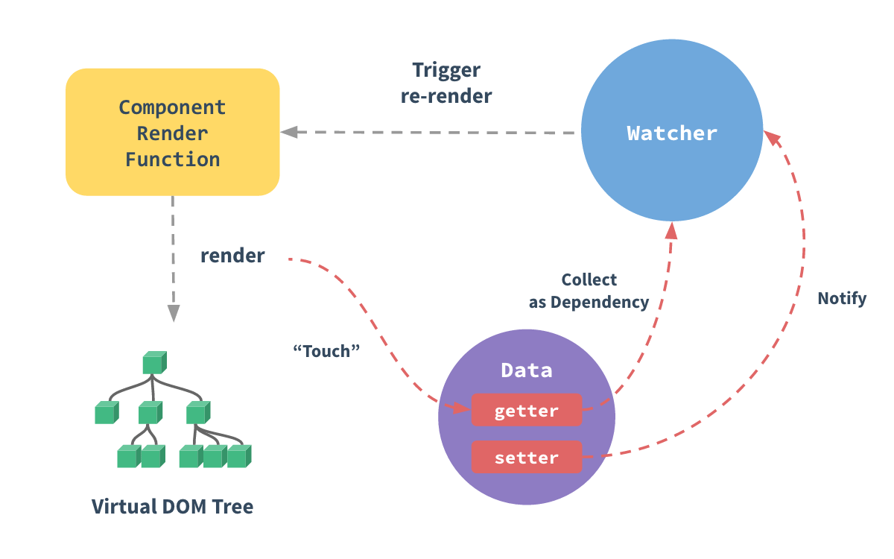

# 시작하며
Vue의 반응형 시스템의 세부사항을 다뤄봅니다.

# 반응형에 대해 깊이 알아보기
## 변경 내용을 추적하는 방법
Vue 인스턴스에 `data` 옵션으로 전달하면 모든 속성에 [Object.defineProperty](https://developer.mozilla.org/en-US/docs/Web/JavaScript/Reference/Global_Objects/Object/defineProperty) 를 사용하여 getter/setters 로 변환합니다.
모든 컴포넌트 인스턴스는 해당 **watcher** 인스턴스가 있으며, 이 인스턴스는 "수정"된 모든 속성을 기록합니다. 나중에 종속적인 setter가 트리거 되면 watcher에 알리고 다시 렌더링 됩니다.

## 변경 감지 경고
Vue는 **속성의 추가 제거를 감지할 수 없습니다.**
